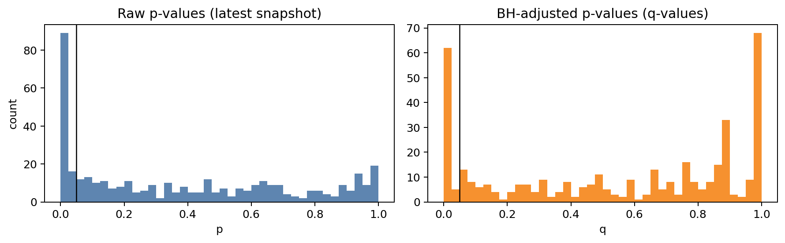
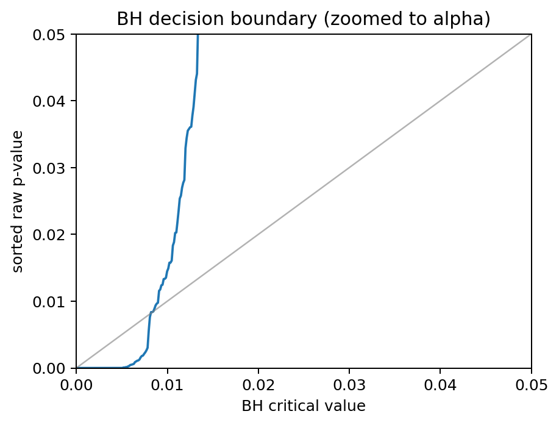
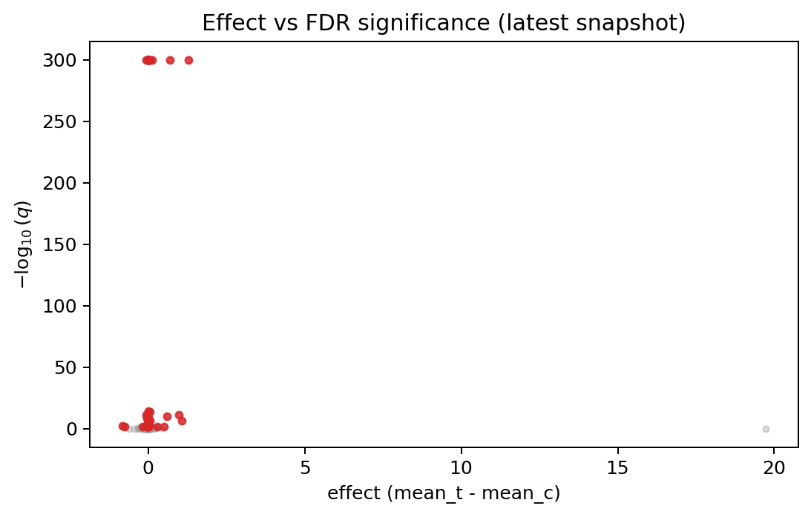
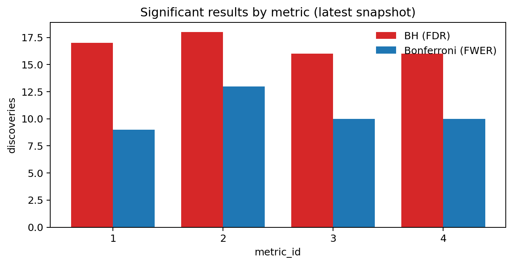
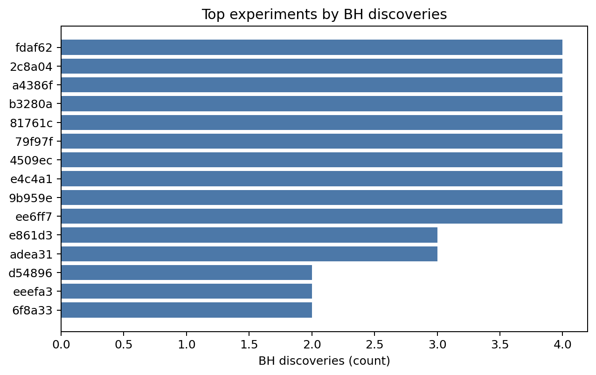
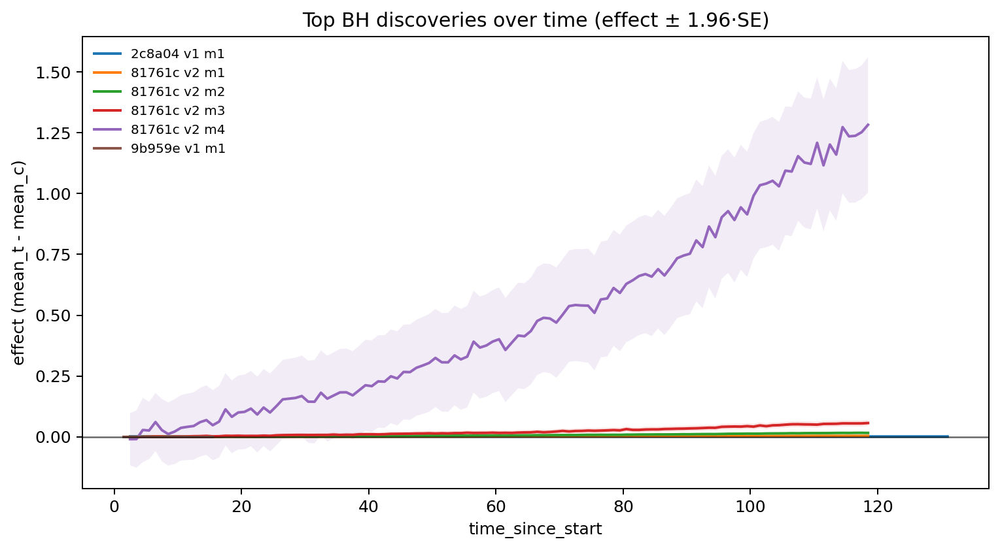

# E-Commerce Experiment Analysis

Statistical analysis of digital experiments using Welch's t-test and multiple testing corrections to identify significant treatment effects.

## Project Overview

This project analyzes **78 experiments** across **4 metrics**, testing **396 experiment-variant-metric combinations** to identify statistically significant improvements in e-commerce performance.

**Methodology**: Welch's t-test with Benjamini-Hochberg (FDR control) and Bonferroni (FWER control) corrections.

## Key Results

- **67 significant discoveries** (16.9%) using BH correction
- **42 significant discoveries** (10.6%) using Bonferroni correction
- **27 experiments** (35%) showed at least one significant result
- **Largest effect**: +1.28 (experiment `81761c`, variant 2, metric 4)
- **Average effect size**: +0.056 across significant results

All four metrics showed similar discovery rates (~16-18%), indicating balanced impact across different business outcomes.

## Visualizations

### P-value Distributions


Raw vs BH-adjusted p-value distributions showing the impact of multiple testing correction.

### BH Decision Boundary


Visual representation of the Benjamini-Hochberg FDR control mechanism.

### Effect vs Significance


Volcano plot highlighting discoveries with large effect sizes and high significance.

### Discoveries by Metric


Comparison of BH vs Bonferroni discoveries across the four metrics.

### Top Experiments


Experiments ranked by number of significant discoveries.

### Temporal Stability


Tracking the top discoveries over time to assess consistency of effects.

## Installation & Usage

```bash
# Install dependencies
pip install -r requirements.txt

# Run analysis
python analysis/multiple_testing_correction.py
```

This generates all visualizations and saves results to `analysis/outputs/welch_latest_multiple_testing.csv`.

## Testing

```bash
pytest tests/
```
