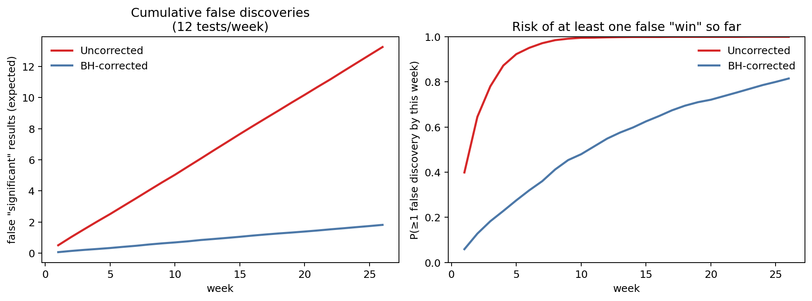
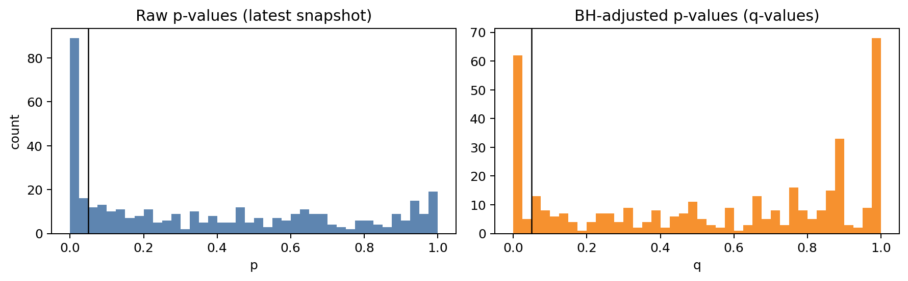
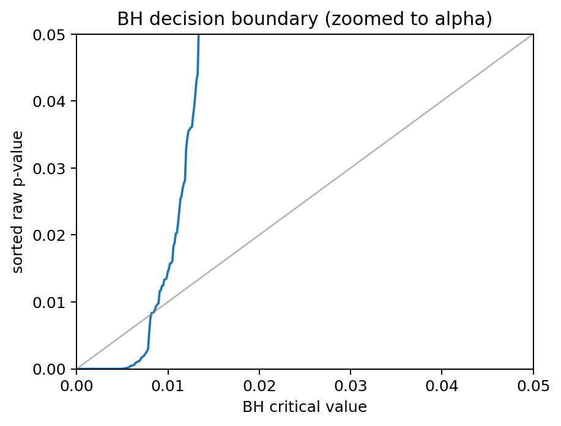
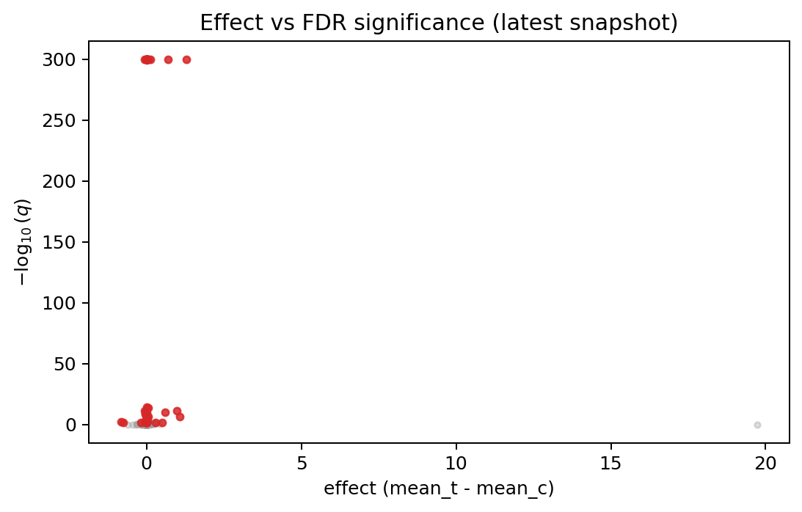
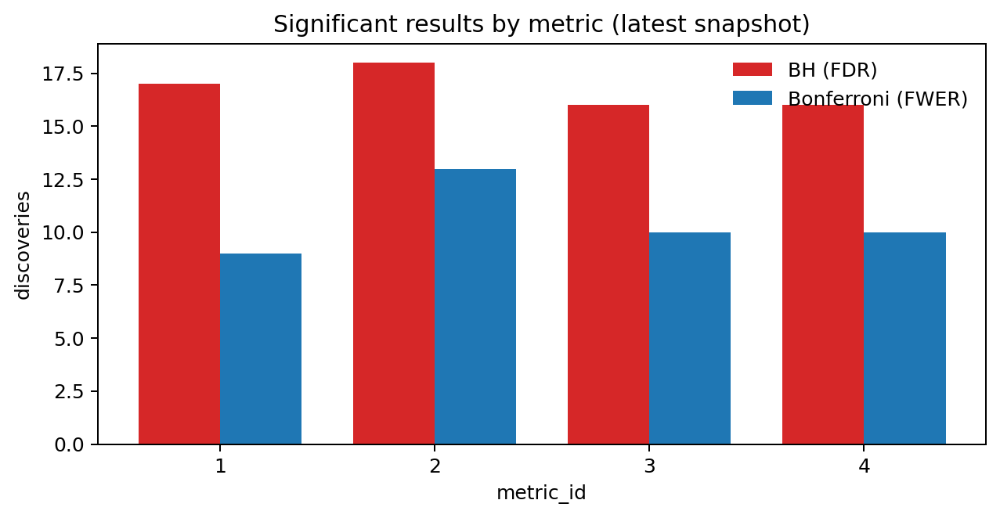
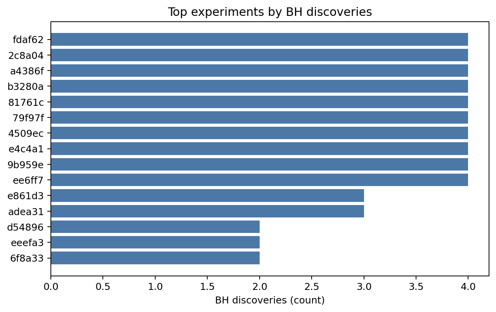
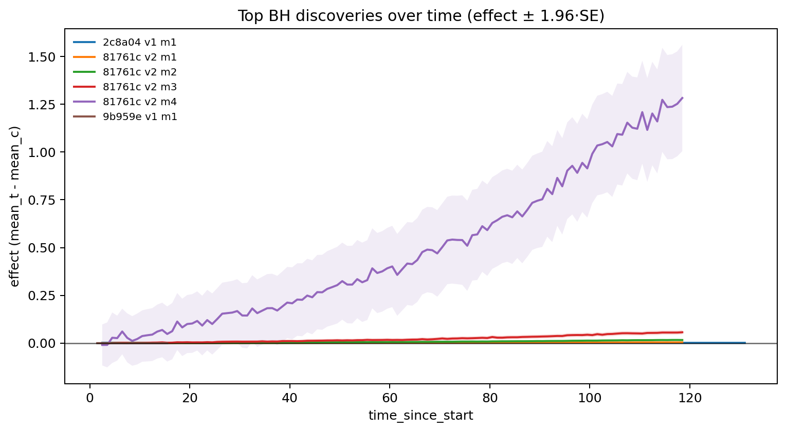

# E-Commerce A/B Testing: What Multiple Comparisons Actually Costs You

Most people who run A/B tests know, in the abstract, that testing a lot of things without correction inflates your false-positive rate. This project starts from a more concrete question: on a real, large-scale testing dataset, how much does that actually cost you, and what does the risk look like once you're not just running one big batch of tests, but running tests every week, indefinitely, the way a real team does?

## The dataset

The [ASOS Digital Experiments Dataset](https://osf.io/64jsb/), released by ASOS.com with Imperial College London (NeurIPS 2021, Liu et al.), contains real A/B test results from a major online fashion retailer: 78 experiments, 4 anonymized business metrics, and 396 experiment-variant-metric combinations. A large retailer's actual testing program being public is rare, which is why it's a better foundation for this than a synthetic dataset would be. The correction question only matters because real testing programs really do run this many tests.

## Part 1: the one-time cost of skipping correction

`analysis/multiple_testing_correction.py` runs Welch's t-test (robust to unequal variances, which real experiment arms usually have) on all 396 combinations, then compares two corrections:

- **Bonferroni**: controls the probability of *any* false positive (FWER), by dividing alpha by the number of tests
- **Benjamini-Hochberg (BH)**: controls the *expected proportion* of false positives among your significant results (FDR), which is less conservative and usually the more practical choice for exploratory testing programs

On this dataset, BH flags 67 significant results (16.9%) and Bonferroni flags 42 (10.6%). That's a 37% drop in "wins" depending purely on which correction you pick, with no change to the underlying data. That gap is the whole argument for taking correction method seriously rather than defaulting to whichever one a stats library runs first.

## Part 2: the compounding cost of doing this every week

The static analysis above answers "how many of today's 396 results are probably noise." It doesn't answer the question an ongoing testing program actually lives with: the tests aren't a single batch of 396, they're some number every week, indefinitely. How fast does that catch up with you if you don't correct for it?

`analysis/fdr_cadence_simulation.py` answers this with a Monte Carlo simulation. At a given weekly test cadence, it simulates many weeks of testing under a realistic mix of true nulls and true effects, and tracks two different things over time:

1. **The per-batch FDR**, which is what BH actually promises to control, recomputed fresh each week
2. **The cumulative risk of at least one false discovery having occurred so far**, which is a different quantity, and the one that actually climbs

Those two are worth separating because it's easy to conflate them. A natural first instinct is to define "empirical FDR" as one pooled ratio: total false discoveries divided by total flagged results, summed across every week. That number doesn't actually match what BH controls, and can look badly broken in a low-signal regime for a subtle reason: under a global null, any single rejection is *by definition* 100% false, so a pooled ratio across many near-empty weekly batches swings wildly and doesn't mean what it looks like it means. The metric that actually matches BH's guarantee is the textbook one, false divided by flagged within each week's batch, averaged across simulations. That's what's plotted here, and it does hover near the nominal 5% for BH, as it should.

With the pooled-ratio bug fixed, the actual result is more interesting than either "BH is broken" or "BH is a fix-all." Even with each week's batch correctly controlled at 5%, running enough weekly batches back to back still drives the cumulative probability of at least one false "win" up toward certainty, just far more slowly than with no correction at all. At **12 tests/week** — an illustrative cadence, not a measured one, so set it from the program you're actually modelling before reading the week counts as more than a worked example — uncorrected testing hits a >90% chance of at least one false discovery within about 5 weeks. BH-corrected testing takes about 36 weeks to reach that same 90% mark — roughly seven times longer, but it still gets there. (The chart below stops at 26 weeks, where BH is still at ~81%; raise `WEEKS` in the script to see the crossing.) Correction doesn't make the long-run risk disappear, it buys time. That's itself the argument for adding sequential or alpha-spending methods on top of BH once a testing program runs indefinitely rather than in fixed batches.

## Visualizations



Left: expected false discoveries accumulating week over week, the quantity that visibly runs away without correction. Right: the cumulative probability that at least one false discovery has occurred by that week, for both approaches.



Raw vs. BH-adjusted p-value distributions on the static 396-test batch. The concentration of raw p-values near zero reflects genuine treatment effects, while the BH-adjusted distribution shows the correction pulling the marginal ones back.



The Benjamini-Hochberg decision boundary. Points below the line are discoveries at FDR ≤ 0.05.



Effect size vs. significance. Red points are FDR-significant; this is the plot that shows correction isn't just throwing away small effects indiscriminately.



BH vs. Bonferroni discoveries across ASOS's four business metrics. Results are consistent across metrics, which suggests the correction-method gap isn't an artifact of one noisy metric.



Experiments ranked by number of significant discoveries.



Whether the top discoveries hold up across the experiment's duration, or look more like early noise.

## Running it

```bash
pip install -r requirements.txt
python analysis/multiple_testing_correction.py      # static 396-test analysis
python analysis/fdr_cadence_simulation.py            # weekly-cadence simulation
pytest tests/
```

## Dataset citation

```
Liu, C. H. B., Cardoso, A., Couturier, P., & McCoy, E. J. (2021).
Datasets for Online Controlled Experiments.
NeurIPS Datasets and Benchmarks Track.
```

## Limitations

- Results reflect ASOS's specific business model and user base. The correction-method gap likely generalizes better than the exact effect sizes do.
- The 2019-2020 data may not reflect current traffic or seasonality patterns.
- Business metrics are anonymized, which limits reading anything into *why* effects are large or small.
- The cadence simulation's true-effect rate (15%) and effect-size distribution are assumptions calibrated loosely to this dataset's own discovery rate, not independently estimated.

## Where this goes next

- Estimate the cadence and true-effect rate from a real testing program's history rather than assuming both
- Add a sequential/alpha-spending version of the cadence simulation, since batch-level BH alone doesn't cap the long-run risk
- Try a Bayesian alternative to BH/Bonferroni on the same data, for comparison
